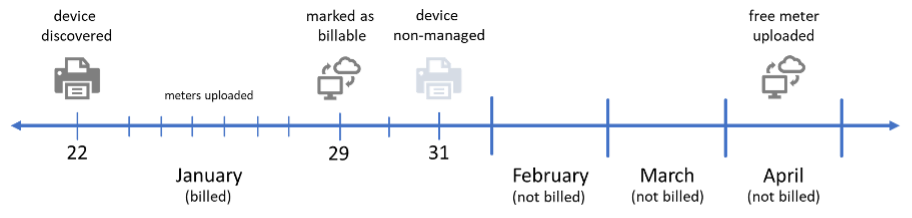

# Billing and Payments

:::caution Note
Print Tracker does not manage billing your customers
:::

## How Does Billing Work?
Print Tracker invoices customers based on the number of managed devices that report meters in a given calendar month. Any managed device that reports a meter during that month will be included in the corresponding invoice, with the exception of newly discovered devices. When a device is first discovered, dealers have a 7-day window to mark it as "non-managed." If the device is still labeled as "managed" after this 7-day period, it will be included in that calendar month's invoice.

### What if I don’t want to monitor certain devices?
If Print Tracker discovers devices that a dealer does not want to monitor, dealers can [disable](./50-dicovering-devices.md#enablingdisabling-devices) the device. This will remove that device from all future invoices. Dealers receive a free meter read each quarter from all non-managed devices.

### I set a device to non-managed. Why was I billed for that device?
If you have set a device to non-managed but were still billed for it, it may be because the device had already reported a meter during that month. In such cases, the device will be included in the current month's invoice but will not be billed in subsequent months.

### New devices automatically show up in Print Tracker. Why does this happen and how do I stop it?
Print Tracker automatically scans a customer’s network every Monday and Thursday to search for newly added devices. When a new device is discovered, it appears on the “New devices” page of the Web Admin. This gives dealers the opportunity to mark them as non-managed within the first 7 days after discovery to avoid being billed for those devices.
If a dealer does not want Print Tracker to search for new devices each week, this setting can be disabled using the following steps:
1.	Navigate to the customer’s entity
2.	Open the entity settings (Admin > Manage Entity > Settings tab)
3.	Expand the section titled “Data Collection Agent”
4.	Uncheck all boxes in the “Scan for new device on days” setting

## Viewing Invoices

## Paying Invoices

## Saving Payment Methods

## Autopay

## Billing Support
For billing inquiries, please contact accounting@printtrackerpro.com.
