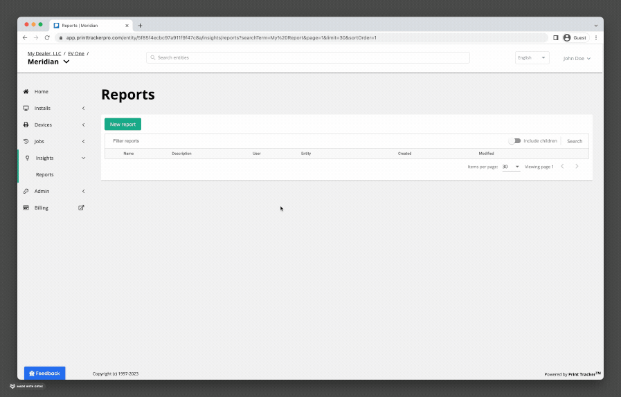
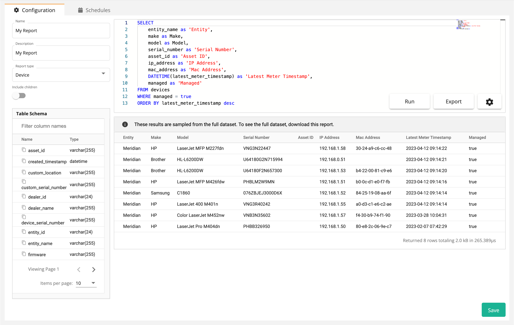
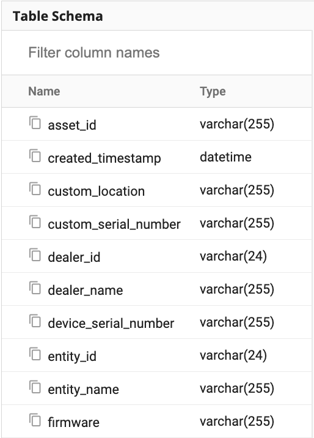
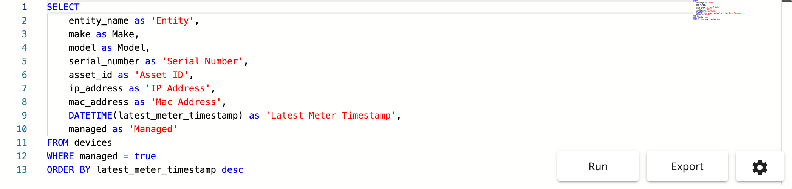
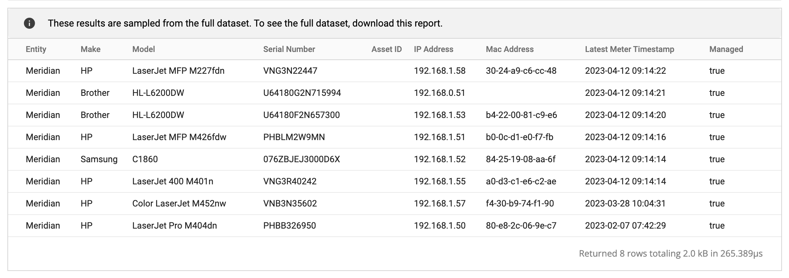
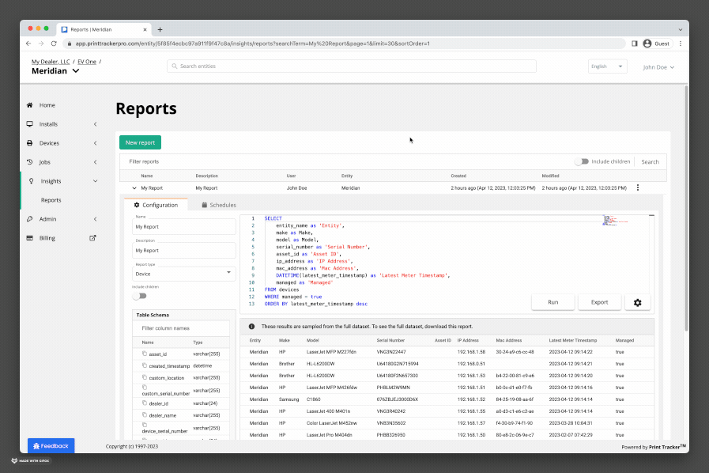
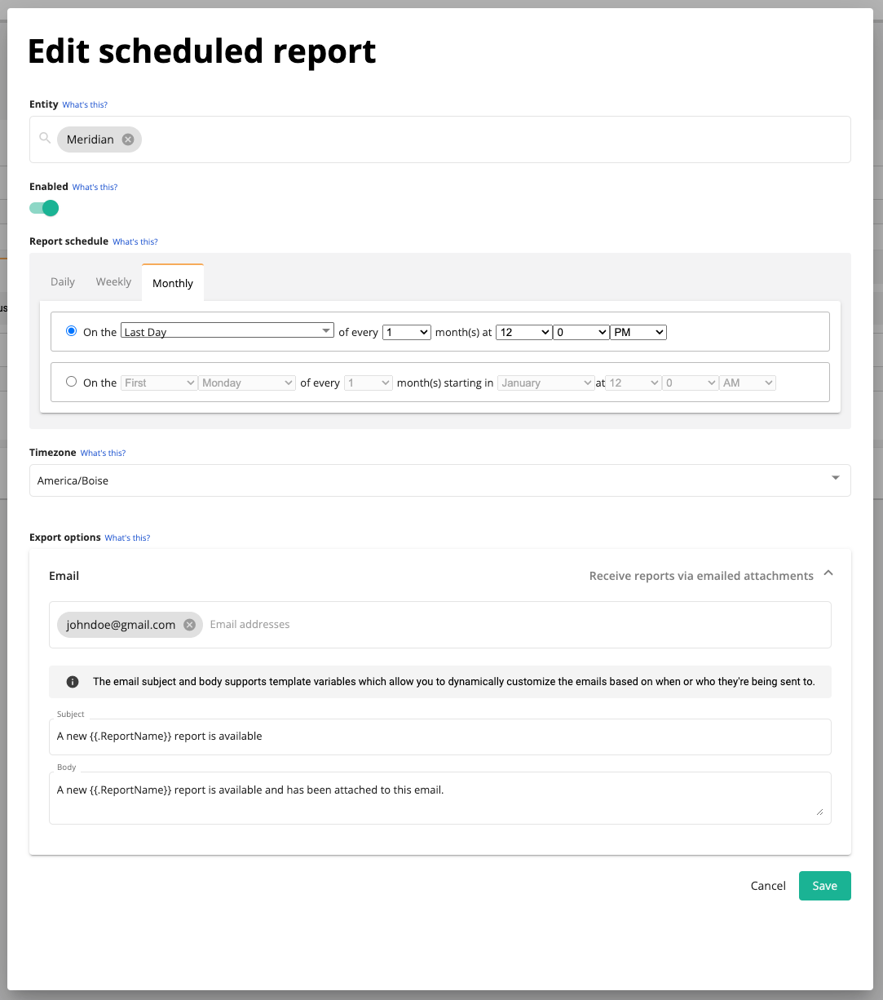
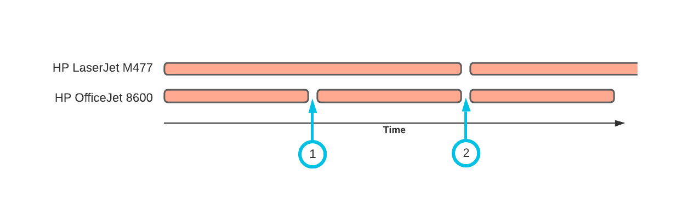

# Custom Reports
Having access to the right data can help businesses find answers to important questions and make better decisions. Print Tracker's custom reports lets users explore their data in a way that suits their needs by allowing them to create and save personalized reports.

## Overview
Custom reports supports a variety of report types, such as device, install, and meter reports, making it versatile for different types of business questions. This flexibility allows you to focus on specific aspects of your operations. To build and customize these reports, the feature utilizes [SQLite](#structured-query-language-sql), a variant of SQL that is lightweight and efficient. By leveraging SQLite, you can easily manage and manipulate their data, creating tailored reports that help you better understand their business and make data-driven decisions.

## Creating Reports


To create a custom report:
1. Using the sidebar, click **Insights > Reports**
2. Click **New report**
3. Enter a name for the report
4. Click **Confirm**
5. Your new report has been created and will have appeared in the list of custom reports
6. Click on your new report to open it

### Report Configuration


You can configure a report using the report editor. The report editor allows you to:
* Change the name and description of the report
* Change the report type
* View the report's schema (the columns that fields that are available for use in the report)
* Change the SQL query used to generate the report
* Run the report to view a sample of the report
* Export the report to a CSV file

For more information on the report types that are available, see [Report Types](#report-types).

### Schema Viewer


Each [report type](#report-types) has its own schema. The schema determines which columns are available for use in your custom report. Each column has a name and a particular data type. For example, to utilize the device's firmware in a report, you could reference the `firmware` column. The data type of this column is [`varchar`](https://en.wikipedia.org/wiki/Varchar) which is a string of characters. On the other hand the `created_timestamp` column is of time `datetime` indicating that we can perform custom date-related calculations on this column, such as calculating the number of days since this device was created.

### Query Editor


The query editor is where you will build, customize, and test your reports. Each [report type](#report-types) comes with a default query that you can use as a starting point. You can also use the schema viewer to help you build your query. Queries are written in SQL using the [SQLite](#structured-query-language-sql) dialect. 


### Query Results


Whenever you click the **Run** button in the [query editor](#query-editor), the results will be displayed below the editor. The results are only a sample of your data which allows you to quickly test your reports on a small subset of your data without having to wait for the entire report to run.

:::info No results?
When adding `WHERE` clauses to your query, you might find that no results are returned when you test your query. This is because when testing the report by clicking **Run**, the query is only run on a sample of your data, and there's no guarantee that the rows in the sample will also match the `WHERE` clause. For these types of queries, you can use the **Export** button to export the entire report to a CSV file and then open the file in a spreadsheet application to view the results.
:::

## Editing and Saving Reports


You can change your report type, the name, description, or query at anytime. To save your changes, click the **Save** button in the bottom right-hand corner.

## Scheduling Reports


You have the flexibility to run ad-hoc reports whenever you need to access specific information quickly. However, you may need to receive a report on a predetermined schedule, such as a monthly billing report. Print Tracker allows you to attach any number of schedules to a custom report. By scheduling a report, you can pick the interval, time of day, the entities where the report should run and Print Tracker will automatically generate the report and send it to your email. This way, you receive the most up-to-date report directly in your inbox without having to manually run it each time.

To schedule a custom report:
1. Using the sidebar, click **Insights > Reports**
2. Click on the report you want to schedule
3. Click on the **Schedules** tab
4. Click **New schedule**

### Schedule Configuration


There are several options available when scheduling a report:
* Entity: You can create a single custom report, but create scheduled reports that run on different schedules, and for different entities. For example, you may want to create a current meter report for each of your customers. In this case you'd [create a single report](#creating-reports) and then create a schedule for each one of your customer entities.
* Enabled: In some cases, you may want to prevent a scheduled report from being sent without having to delete the report, or the schedule. In this case you can disable the **Enabled** toggle, and the report will no longer be sent.
* Report schedule: You can configure the report to run on any interval you'd like. Refer to [Choosing the Report Schedule](#choosing-the-report-schedule) for more information on how to pick the correct schedule for your report.
* Timezone: Many printer fleets are distributed across multiple timezones. To ensure that the report is sent at the correct time, you can select the timezone that the report should be sent in.
* Email: You can configure the report to be sent to any number of email addresses.
* Subject: You can customize the subject of the email. See [Email Template Variables](#email-template-variables) for a list of variables that you can use in the subject line.
* Body: You can customize the body of the email.  See [Email Template Variables](#email-template-variables) for a list of variables that you can use in the body.

### Choosing the Report Schedule
The right report schedule depends on the [report type](#report-types) that you're using. Understanding how schedules work in conjunction with the report type will help you pick the correct schedule for your report.

### Email Template Variables
Scheduled custom report emails can be configured with a custom subject and body line. In order to make it easier to customize these fields, you can use variables in the subject and body. The following variables are available:

| Variable          | Description                                                                              |
|-------------------|------------------------------------------------------------------------------------------|
| `{{.ReportName}}` | The name of the report. In the example screenshots above, the report name is "My Report" |

:::info
Email template variables are a newer feature. Please reach out to [support@printtrackerpro.com](mailto:support@printtrackerpro.com) if you'd like to see additional variables supported.
:::

[//]: # (### Billing Period Report)

## Report Types
Each custom report must specify a report type. A report type determines the data that is available for use in your custom report. For example, the [Device](#device) report type will only have columns that are related to devices, whereas the [Volume Analysis](#volume-analysis) report type will have columns comparing meter reads between two different dates. When creating a custom report, you'll pick the report type that best fits your needs.

### Device
Device reports contain only information about the device. These reports are often useful for understanding your fleet. The device report contains the following columns:

| Column Name                         | Data Type  | Description                                                                                                                                |
|-------------------------------------|------------|--------------------------------------------------------------------------------------------------------------------------------------------|
| `id`                                | `varchar`  | The unique identifier for the device                                                                                                       |
| `dealer_id`                         | `varchar`  | The unique identifier for the dealer entity (if you're a dealer, this would be your root-level entity)                                     |
| `dealer_name`                       | `varchar`  | The name of the dealer entity                                                                                                              |
| `entity_id`                         | `varchar`  | The unique identifier for the entity that this device belongs to (the entity directly above the device)                                    |
| `entity_name`                       | `varchar`  | The name of the entity that this device belongs to                                                                                         |
| `integration_id`                    | `varchar`  | The unique identifier for the device imported from [other integrations such as E-Automate](./integrations#third-party-integrations)        |
| `asset_id`                          | `varchar`  | A custom identifier that you can specify for a device. These are usually human-friendly identifiers that are propreitary for your business |
| `make`                              | `varchar`  | The manufacturer of the device (e.g. HP, Brother)                                                                                          |
| `model`                             | `varchar`  | The model of the device (e.g. OfficeJet 8600)                                                                                              |
| `serial_number`                     | `varchar`  | The serial number of the device as specified by the device                                                                                 |
| `custom_serial_number`              | `varchar`  | The serial number of the device as specified by a user in the webadmin                                                                     |
| `location`                          | `varchar`  | The location of the device as specified by the device                                                                                      |
| `custom_location`                   | `varchar`  | The location of the device as configured by a user in the webadmin                                                                         |
| `ip_address`                        | `varchar`  | The IP address of the device                                                                                                               |
| `mac_address`                       | `varchar`  | The MAC address of the device                                                                                                              |
| `hostname`                          | `varchar`  | The [hostname](https://en.wikipedia.org/wiki/Hostname) of the device                                                                       |
| `system_name`                       | `varchar`  | The [SNMP system name](https://oidref.com/1.3.6.1.2.1.1.5) of the device                                                                   |
| `firmware`                          | `varchar`  | The firmware version or datecode currently installed on the device                                                                         |
| `note`                              | `varchar`  | The notes attached to the device. Notes can be added within Print Tracker                                                                  |
| `source_install_name`               | `varchar`  | The machine name of the computer running the Print Tracker data collection agent that is managing this device                              |
| `source_install_private_ip_address` | `varchar`  | The private IP address of the computer running the Print Tracker data collection agent.                                                    |
| `source_install_public_ip_address`  | `varchar`  | The public IP address of the computer running the Print Tracker data collection agent.                                                     |
| `created_timestamp`                 | `datetime` | The timestamp when this device was created in Print Tracker                                                                                |
| `modified_timestamp`                | `datetime` | The timestamp when this device was modified in Print Tracker                                                                               |
| `latest_meter_timestamp`            | `datetime` | The timestamp of the most recently uploaded meter                                                                                          |
| `managed`                           | `boolean`  | Indicates whether this device is [managed or non-managed](./discovery#managed-devices) in Print Tracker                                    |

Here are some examples of how you might utilize the device report type:

#### Number of Days Since Last Meter by Device
This report returns the number of days since the last meter was uploaded for each device. This is useful for identifying devices that are stale and may need to be reviewed manually.

```sql
SELECT
    entity_name as 'Entity',
    make as Make,
    model as Model,
    serial_number as 'Serial Number',
    asset_id as 'Asset ID',
    ip_address as 'IP Address',
    mac_address as 'Mac Address',
    DATETIME(latest_meter_timestamp) as 'Latest Meter Timestamp',

    -- Calculates the number of days between the current day and the latest meter
    ROUND(JULIANDAY(datetime()) - JULIANDAY(latest_meter_timestamp)) as 'Days Since Last Meter',
    managed as 'Managed'
FROM devices
WHERE managed = true
ORDER BY latest_meter_timestamp desc
```

#### Number of Devices by Make and Model
This report returns the number of devices by make and model, ordered by the most popular model.

```sql
SELECT
    make as Make,
    model as Model,
    COUNT(*) as 'Number of Devices'
FROM devices
GROUP BY make, model
ORDER BY COUNT(*) DESC
```

### Install
The install report contains information about the Print Tracker data collection agent. The install report contains the following columns:

| Column Name               | Data Type  | Description                                                                                                       |                                                                                                                  
|---------------------------|------------|-------------------------------------------------------------------------------------------------------------------|
| `id`                      | `varchar`  | The unique identifier for the install                                                                             |
| `entity_id`               | `varchar`  | The unique identifier for the entity that this install belongs to (the entity directly above the install)         |
| `entity_name`             | `varchar`  | The name of the entity that this install belongs to                                                               |
| `hostname`                | `varchar`  | The [hostname](https://en.wikipedia.org/wiki/Hostname) of the device                                              |
| `created_timestamp`       | `datetime` | The timestamp when this install was registered in Print Tracker                                                   |
| `modified_timestamp`      | `datetime` | The timestamp when this install was modified in Print Tracker                                                     |
| `last_check_in_timestamp` | `datetime` | The last time this install checked in with Print Tracker                                                          |
| `ip_address`              | `varchar`  | The private IP address of the install                                                                             |
| `public_ip_address`       | `varchar`  | The public IP address of the install                                                                              |
| `version`                 | `varchar`  | The version of the Print Tracker data collection agent                                                            |
| `os`                      | `varchar`  | The operating system of the computer (e.g. Microsoft Windows 10 Pro)                                              |
| `os_family`               | `varchar`  | The operating system family of the computer (e.g. Standalone Workstation)                                         |
| `os_version`              | `varchar`  | The operating system version of the computer (e.g. 10.0.19045 Build 19045)                                        |
| `cpu_architecture`        | `varchar`  | The CPU architecture of the computer (e.g. 64 or 32)                                                              |
| `antivirus`               | `varchar`  | The antivirus application installed on this computer                                                              |
| `is_laptop`               | `boolean`  | Indicates whether the agent is installed on a laptop computer                                                     |
| `is_local`                | `boolean`  | Indicates whether the agent is configured to track USB-connected devices (Windows only)                           |
| `reporting_devices`       | `integer`  | The number of managed devices tracked by this install that have reported a meter this month                       |
| `active_devices`          | `integer`  | The number of managed devices tracked by this install regardless of whether they have reported a meter this month |

Here are some examples of how you might utilize the install report type:

#### Stale Installs
This report returns all the installs that have not checked-in in more than 24 hours.

```sql
SELECT
    entity_name as 'Entity Name',
    hostname as 'Hostname',
    version as 'Version',
    os as 'Operating System',
    antivirus as 'Antivirus',
    is_laptop as 'Laptop',
    ip_address as 'IP Address',
    DATETIME(created_timestamp) as 'Created',
    DATETIME(last_check_in_timestamp) as 'Check-in',

    -- Count the number of days since this install last checked in
    printf('%d days', ROUND(JULIANDAY(DATE('now')) - JULIANDAY(last_check_in_timestamp), 0)) as 'Offline',

    -- Add a column with a link to the install so that it's easy to find
    printf('https://app.printtrackerpro.com/entity/%s/installs/list?searchTerm=%s', entity_id, id) as 'Link'
FROM installs
WHERE status = 1
    -- Only return installs that haven't checked in in more than 24 hours
    AND last_check_in_timestamp < DATE('now', '-24 hours')
ORDER BY last_check_in_timestamp DESC
```

### Current Meter
The current meter read report allows you to view your devices and the latest values of all their meters. The current meter report contains the following columns:

| Column Name              | Data Type  | Description                                                                                                                                                                                                                                                                                                  |
|--------------------------|------------|--------------------------------------------------------------------------------------------------------------------------------------------------------------------------------------------------------------------------------------------------------------------------------------------------------------|
| `device_id`              | `varchar`  | The unique identifier for the device                                                                                                                                                                                                                                                                         |
| `entity_id`              | `varchar`  | The unique identifier for the entity that this device belongs to (the entity directly above the device)                                                                                                                                                                                                      |
| `entity_name`            | `varchar`  | The name of the entity that this device belongs to                                                                                                                                                                                                                                                           |
| `integration_id`         | `varchar`  | The unique identifier for the device imported from [other integrations such as E-Automate](./integrations#third-party-integrations)                                                                                                                                                                          |
| `asset_id`               | `varchar`  | A custom identifier that you can specify for a device. These are usually human-friendly identifiers that are propreitary for your business                                                                                                                                                                   |
| `make`                   | `varchar`  | The manufacturer of the device (e.g. HP, Brother)                                                                                                                                                                                                                                                            |
| `model`                  | `varchar`  | The model of the device (e.g. OfficeJet 8600)                                                                                                                                                                                                                                                                |
| `serial_number`          | `varchar`  | The serial number of device collected during the latest meter read. This should always match the `device_serial number`                                                                                                                                                                                      |
| `device_serial_number`   | `varchar`  | The serial number of the device as specified by the device                                                                                                                                                                                                                                                   |
| `custom_serial_number`   | `varchar`  | The serial number of the device as specified by a user in the webadmin                                                                                                                                                                                                                                       |
| `location`               | `varchar`  | The location of the device as specified by the device                                                                                                                                                                                                                                                        |
| `custom_location`        | `varchar`  | The location of the device as configured by a user in the webadmin                                                                                                                                                                                                                                           |
| `ip_address`             | `varchar`  | The IP address of the device                                                                                                                                                                                                                                                                                 |
| `mac_address`            | `varchar`  | The MAC address of the device                                                                                                                                                                                                                                                                                |
| `hostname`               | `varchar`  | The [hostname](https://en.wikipedia.org/wiki/Hostname) of the device                                                                                                                                                                                                                                         |
| `system_name`            | `varchar`  | The [SNMP system name](https://oidref.com/1.3.6.1.2.1.1.5) of the device                                                                                                                                                                                                                                     |
| `firmware`               | `varchar`  | The firmware version or datecode currently installed on the device                                                                                                                                                                                                                                           |
| `latest_meter_timestamp` | `datetime` | The timestamp of the most recently uploaded meter                                                                                                                                                                                                                                                            |
| `managed`                | `boolean`  | Indicates whether this device is [managed or non-managed](./discovery#managed-devices) in Print Tracker                                                                                                                                                                                                      |
| `pageCounts_*`           |            | All available counter columns start with the prefix `pageCounts_` followed by the counter. Print Tracker supports over 450 different page counts. For more details on the page counts available in custom reports, see [Meter and Supply Columns](#meter-and-supply-columns)                                 |
| `supplies_*`             |            | All available supply columns start with the prefix `supplies_` followed by the supply attributes and values. Print Tracker supports over 375 different supplies and attributes. For more details on the supplies and attributes in custom reports, see [Meter and Supply Columns](#meter-and-supply-columns) |

Here are some examples of how you might utilize the current meter report type:

#### Current Counter Values by Device
This report returns the current values of all the counters for each device.

```sql
SELECT
    entity_name as 'Entity',
    make as Make,
    model as Model,
    serial_number as 'Serial Number',
    asset_id as 'Asset ID',
    ip_address as 'IP Address',
    DATETIME(latest_meter_timestamp) as 'Latest Meter Timestamp',
    pageCounts_default_total as 'Total',
    pageCounts_default_totalBlack as 'Total Black',
    pageCounts_default_totalColor as 'Total Color'
FROM meters
WHERE managed = true
ORDER BY latest_meter_timestamp desc
```

### Volume Analysis
The volume analysis report allows you to compare the meter reads between two dates. The default volume analysis report calculates additional volume columns by subtracting the current counters from the previous counters. The volume analysis report contains the following columns:

| Column Name              | Data Type  | Description                                                                                                                                                                                                                                                                                                                                |
|--------------------------|------------|--------------------------------------------------------------------------------------------------------------------------------------------------------------------------------------------------------------------------------------------------------------------------------------------------------------------------------------------|
| `device_id`              | `varchar`  | The unique identifier for the device                                                                                                                                                                                                                                                                                                       |
| `entity_id`              | `varchar`  | The unique identifier for the entity that this device belongs to (the entity directly above the device)                                                                                                                                                                                                                                    |
| `entity_name`            | `varchar`  | The name of the entity that this device belongs to                                                                                                                                                                                                                                                                                         |
| `integration_id`         | `varchar`  | The unique identifier for the device imported from [other integrations such as E-Automate](./integrations#third-party-integrations)                                                                                                                                                                                                        |
| `asset_id`               | `varchar`  | A custom identifier that you can specify for a device. These are usually human-friendly identifiers that are propreitary for your business                                                                                                                                                                                                 |
| `make`                   | `varchar`  | The manufacturer of the device (e.g. HP, Brother)                                                                                                                                                                                                                                                                                          |
| `model`                  | `varchar`  | The model of the device (e.g. OfficeJet 8600)                                                                                                                                                                                                                                                                                              |
| `serial_number`          | `varchar`  | The serial number of device collected during the latest meter read. This should always match the `device_serial number`                                                                                                                                                                                                                    |
| `device_serial_number`   | `varchar`  | The serial number of the device as specified by the device                                                                                                                                                                                                                                                                                 |
| `custom_serial_number`   | `varchar`  | The serial number of the device as specified by a user in the webadmin                                                                                                                                                                                                                                                                     |
| `location`               | `varchar`  | The location of the device as specified by the device                                                                                                                                                                                                                                                                                      |
| `custom_location`        | `varchar`  | The location of the device as configured by a user in the webadmin                                                                                                                                                                                                                                                                         |
| `ip_address`             | `varchar`  | The IP address of the device                                                                                                                                                                                                                                                                                                               |
| `mac_address`            | `varchar`  | The MAC address of the device                                                                                                                                                                                                                                                                                                              |
| `hostname`               | `varchar`  | The [hostname](https://en.wikipedia.org/wiki/Hostname) of the device                                                                                                                                                                                                                                                                       |
| `system_name`            | `varchar`  | The [SNMP system name](https://oidref.com/1.3.6.1.2.1.1.5) of the device                                                                                                                                                                                                                                                                   |
| `firmware`               | `varchar`  | The firmware version or datecode currently installed on the device                                                                                                                                                                                                                                                                         |
| `latest_meter_timestamp` | `datetime` | The timestamp of the most recently uploaded meter                                                                                                                                                                                                                                                                                          |
| `managed`                | `boolean`  | Indicates whether this device is [managed or non-managed](./discovery#managed-devices) in Print Tracker                                                                                                                                                                                                                                    |
| `first_pageCounts_*`     |            | All available counter columns from the first/earliest meter read start with the prefix `first_pageCounts_` followed by the counter. Print Tracker supports over 450 different page counts. For more details on the page counts available in custom reports, see [Meter and Supply Columns](#meter-and-supply-columns)                      |
| `last_pageCounts_*`      |            | All available counter columns from the last/latest meter read start with the prefix `last_pageCounts_` followed by the counter. Print Tracker supports over 450 different page counts. For more details on the page counts available in custom reports, see [Meter and Supply Columns](#meter-and-supply-columns)                          |
| `first_supplies_*`       |            | All available supply columns from the first/earliest start with the prefix `first_supplies_` followed by the supply attributes and values. Print Tracker supports over 375 different supplies and attributes. For more details on the supplies and attributes in custom reports, see [Meter and Supply Columns](#meter-and-supply-columns) |
| `last_supplies_*`        |            | All available supply columns from the last/latest start with the prefix `first_supplies_` followed by the supply attributes and values. Print Tracker supports over 375 different supplies and attributes. For more details on the supplies and attributes in custom reports, see [Meter and Supply Columns](#meter-and-supply-columns)    |

#### Total Volume by Device
This example query returns the total number of pages printed for each device:
```sql
SELECT
    entity_name as 'Entity',
    make as 'Make',
    model as 'Model',
    serial_number as 'Serial Number',
    asset_id as 'Asset ID',
    ip_address as 'IP Address',
    mac_address as 'Mac Address',
    location as 'Location',
    DATETIME(first_meter_timestamp) as 'First Timestamp',
    DATETIME(last_meter_timestamp) as 'Last Timestamp',
    ROUND(JULIANDAY(last_meter_timestamp) - JULIANDAY(first_meter_timestamp), 2) as 'Days Between Meters',
    last_pageCounts_default_total - first_pageCounts_default_total as 'Total Volume'
FROM meters
```

### Billing Period
The billing period report has the same schema (columns) as the [volume analysis report](#volume-analysis), however instead of picking a start date and an end date like you would for a volume analysis report, you specify only a **billing date**. This report is based on a [device's billing schedule](./20-configuring-settings.md#schedules). Device's will be included in this report, as long as the device's billing schedule aligns with your chosen billing date.

Billing periods are sometimes tricky to understand, so let's walk through an example. Let's assume that we have the following devices each with a different billing schedule:

| Device            | Billing Schedule                 |
|-------------------|----------------------------------|
| HP LaserJet M477  | 1st Day of the Month, Bi-monthly |
| HP OfficeJet 8700 | 1st Day of the Month, Monthly    |

You may notice that while these two devices have differing billing schedules, they actually both need to be billed on the same day, every other month. In the following diagram, notice how in month 1 (first blue circle) we only bill the customer for the HP OfficeJet 8600 device. However in the second month (second blue circle) we bill the customer for both devices, since once of the devices should only be billed bi-monthly.



The billing period report takes into consideration this idea of differing billing schedules by device and allows you to create a single report that includes all devices whose billing schedules land on the date that you select when configuring the report regardless of the interval of each device's billing schedule. 

We mentioned previously that the billing period report has all the same columns as the volume analysis report, which means that the report gives us access to meter read columns from both the first and the last meters in the billing period. While the last meter read timestamps will almost always be the same date across your devices (the report's billing date), the first meter read can vary from device to device. In the previous example, when we receive our billing period report, the first meter read of the HP LaserJet M477 will be two months ago, and the first meter read of the HP OfficeJet 8700 will be one month ago. 


### Estimated Depletion
### Monthly Volume
### Supplies

## Meter and Supply Columns
:::tip
Questions? Our support team is ready and willing to help you configure your custom reports. [support@printtrackerpro.com](mailto:support@printtrackerpro.com)
:::

Custom reports supports over 450 different page count columns and over 375 different supply columns. We are always adding meter-related columns to our custom reports so the list of supported columns is always changing. If you're wondering what columns are available to you, try searching "pageCounts" in the [schema viewer](#schema-viewer).)

The general structure of the columns follows this pattern:
```
pageCounts_<format>_<counter>
supplies_<supply>_<attribute>
```

* Format: The format represents the format that the counter is measured in. Common formats are equivalent, engine, and life (otherwise known as non-equivalent).
* Counter: The actual name of the counter. Common counters are Total, Total Black, Total Color, Total Copies, Total Prints, etc.
* Supply: The name of the supply. Common supplies are Black Toner, Magenta Toner, Yellow Toner, Cyan Toner, Waste Toner, etc.
* Attribute: The attribute on the supply. Supported attributes vary by device. Most devices support the Percent Remaining, Description, and Type attributes, while other devices might provide Fill Rate, Estimated Depletion Date, etc.

Here are some examples of the most commonly used columns
* `pageCount_equiv_total`
* `pageCount_equiv_totalBlack`
* `pageCount_equiv_totalColor`
* `pageCount_life_total`
* `pageCount_life_totalBlack`
* `pageCount_life_totalColor`
* `supplies_blackToner_pctRemaining`
* `supplies_blackToner_type`
* `supplies_blackToner_color`
* `supplies_blackToner_description`
* `supplies_waste_pctRemaining`

## Caveats

## Structured Query Language (SQL)
Print Tracker utilizes a variant of SQL called [SQLite](https://www.sqlite.org/lang.html).