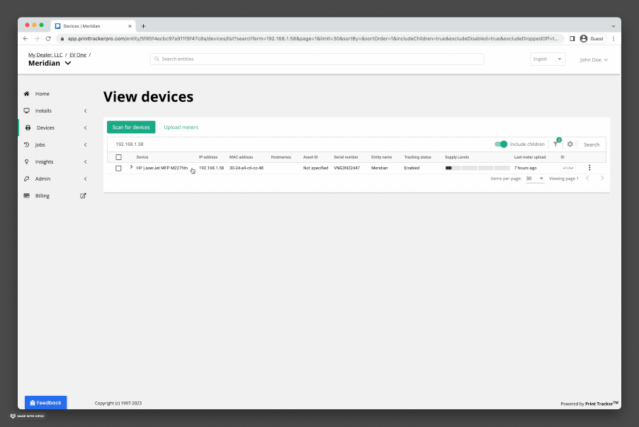

# Remote Technician
Remote Technician allows remote access to a device's embedded webserver from anywhere. It does not require any special network or firewall configuration and works out of the box. Remote Technician allows users to restart the device, upgrade firmware, view the front-panel, change settings, and more [^1].

:::info
Wondering about security? Check out the [Remote Technician Security Overview](../security/remote-technician.md).
:::

## Opening a Session

To open a Remote Technician session:
1. Using the sidebar, click **Devices > View devices**
2. Find the device you want to access in the list of devices
3. Click on the **Remote Technician** tab
4. Click **Open Device Webpage**

A new browser tab will appear. It may take a few seconds to connect to the device. Once connected, you will be able to access the device's embedded webserver.

:::caution Note
Remote Technician will not be able to connect to the device in the following cases:
* The device is turned off
* The device is not connected to the local network
* The data collection agent is not on the same network as the device (for example, if the data collection agent is on a laptop, and the laptop is taken home)
:::

## Restricting Access

### By Install

### By Entity

### By User

## Compatibility
Remote Technician is compatible with nearly all devices regardless of manufacturer, however for some devices, not all features are guaranteed to work. The following devices are known to have compatibility issues:

| Device                                     | Issue                                                                                                                                                              |
|--------------------------------------------|--------------------------------------------------------------------------------------------------------------------------------------------------------------------|
| Canon iR-ADV C5240  Canon iR-ADV C5850 | Authentication does not work. If the device has some pages that are protected by a username and password, you may not be able login or access the protected pages. |

[^1]: Remote Technician only allows remote access to a device's embedded webserver. Only operations that can be performed from the device's webpage can be performed. These operations are supported on some devices, but may not be supported by all devices.